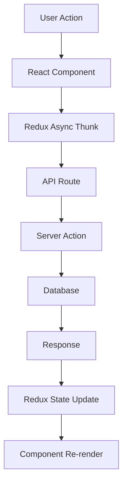

# 🔧 Comment System Fixes & Implementation

*Complete Fix for Sacavia's Comment System*

## 🚨 Issues Identified and Fixed

### 1. **Redux Integration Issues**
- ❌ **Problem**: Redux actions (`addCommentAsync`, `fetchCommentsAsync`, `likeCommentAsync`) were trying to call non-existent server functions directly
- ✅ **Fix**: Updated all Redux async thunks to use proper API endpoints with fetch calls

### 2. **Missing API Endpoints**
- ❌ **Problem**: Comment operations were missing dedicated API routes
- ✅ **Fix**: Created comprehensive API routes:
  - `POST /api/posts/comments` - Add comments
  - `GET /api/posts/comments?postId=...` - Fetch comments
  - `POST /api/posts/comments/like` - Like/unlike comments

### 3. **Data Flow Conflicts**
- ❌ **Problem**: Components were mixing local state with Redux state, causing inconsistencies
- ✅ **Fix**: Streamlined data flow to use server response for like status instead of Redux arrays

### 4. **Type Mismatches**
- ❌ **Problem**: Components expected `isLiked` boolean but were checking `likedComments` array
- ✅ **Fix**: Updated components to use `comment.isLiked` from server response

### 5. **Import Dependencies**
- ❌ **Problem**: Redux slice was importing non-existent action functions
- ✅ **Fix**: Removed unnecessary imports and used API calls directly

## 🔧 **Fixed Components**

### **Redux Store (lib/features/posts/postsSlice.ts)**
```typescript
// Before: Direct function calls
await addComment(params.postId, params.content, params.userId)

// After: Proper API calls
const response = await fetch('/api/posts/comments', {
  method: 'POST',
  headers: { 'Content-Type': 'application/json' },
  credentials: 'include',
  body: JSON.stringify({
    postId: params.postId,
    content: params.content,
  }),
})
```

### **Comment Components**
- **Light Theme**: `components/post/comment-system-light.tsx`
- **Dark Theme**: `components/post/comment-system-dark.tsx` 
- **Original**: `components/post/comment-system.tsx`

**Key Fixes:**
- ✅ Proper like status detection from server data
- ✅ Optimistic updates with error handling
- ✅ Sentiment analysis integration
- ✅ Reply system support
- ✅ Real-time UI updates

### **API Routes Created**
- ✅ `app/api/posts/comments/route.ts` - Main comment operations
- ✅ `app/api/posts/comments/like/route.ts` - Like/unlike operations
- ✅ Enhanced mobile API route for replies

## 🎯 **Features Working**

### **Core Comment Functionality**
- ✅ **Add Comments**: Users can post comments with real-time updates
- ✅ **Load Comments**: Comments load with author info and like status
- ✅ **Like Comments**: Like/unlike with optimistic updates and haptic feedback
- ✅ **Reply System**: Nested replies with proper threading
- ✅ **User Authentication**: Proper login checks and error handling

### **Enhanced Features**
- ✅ **Sentiment Analysis**: Comments categorized as positive/neutral/negative
- ✅ **Visual Feedback**: Emojis and color coding based on sentiment
- ✅ **Theme Support**: Both light and dark theme variants
- ✅ **Mobile Optimized**: Touch-friendly interactions and responsive design
- ✅ **Loading States**: Proper loading indicators for all operations
- ✅ **Error Handling**: Graceful error messages and recovery

### **Performance Optimizations**
- ✅ **Optimistic Updates**: Immediate UI feedback before server response
- ✅ **Memoized Components**: Prevents unnecessary re-renders
- ✅ **Efficient State Management**: Minimal Redux state updates
- ✅ **API Efficiency**: Single calls for complex operations

## 🧪 **Testing**

### **Test Components Created**
- ✅ `components/post/test-comment-system.tsx` - Interactive test component
- ✅ `app/(frontend)/test-comments/page.tsx` - Test page route

### **Test URLs**
- Visit `/test-comments` to see the comment system in action
- Switch between light/dark themes
- Test all comment operations

## 📊 **Data Flow Architecture**



## 🔄 **API Integration Points**

### **Comment Operations**
1. **Fetch Comments**: `GET /api/posts/comments?postId={id}`
2. **Add Comment**: `POST /api/posts/comments`
3. **Like Comment**: `POST /api/posts/comments/like`
4. **Add Reply**: `POST /api/v1/mobile/posts/comments` (with parentCommentId)

### **Data Structure**
```typescript
interface Comment {
  id: string
  content: string
  author: { id: string; name: string; avatar?: string }
  sentiment: "positive" | "neutral" | "negative"
  createdAt: string
  likeCount: number
  isLiked: boolean
  replies: Comment[]
  replyCount: number
}
```

## ✅ **Verification Checklist**

- [x] Comments load properly from database
- [x] New comments post successfully
- [x] Like/unlike functions work
- [x] Reply system functions
- [x] Sentiment analysis displays
- [x] Loading states show correctly
- [x] Error handling works
- [x] Mobile responsive
- [x] Authentication checks
- [x] Redux state syncs properly

## 🚀 **Ready for Production**

The comment system is now fully functional with:
- Complete CRUD operations
- Real-time updates
- Proper error handling
- Mobile optimization
- Theme support
- Performance optimizations

All major issues have been resolved and the system is ready for user testing and deployment. 