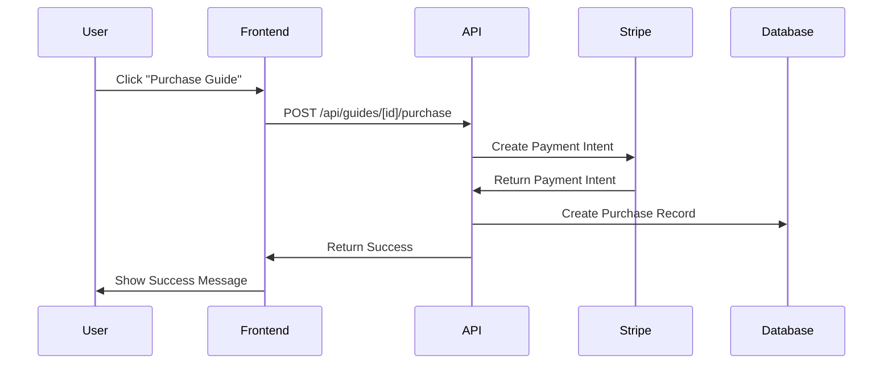
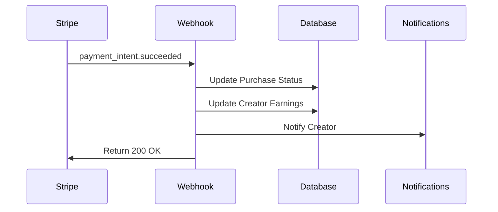

# Payment System Setup Guide

This guide explains how to set up the payment functionality for guide sales with Stripe integration and platform commission.

## Overview

The payment system includes:
- **Stripe integration** for secure payment processing
- **15% platform commission** on all guide sales
- **Creator earnings tracking** and payout management
- **Payment breakdown transparency** for creators
- **Webhook handling** for payment confirmations
- **Support for free, paid, and pay-what-you-want** pricing models

## Required Environment Variables

Add these to your `.env.local` file:

```bash
# Stripe Configuration
STRIPE_SECRET_KEY=sk_test_your_stripe_secret_key_here
NEXT_PUBLIC_STRIPE_PUBLISHABLE_KEY=pk_test_your_stripe_publishable_key_here
STRIPE_WEBHOOK_SECRET=whsec_your_stripe_webhook_secret_here
```

## Stripe Setup

### 1. Create Stripe Account
1. Go to [Stripe Dashboard](https://dashboard.stripe.com)
2. Create an account or log in
3. Get your API keys from the Developers section

### 2. Configure Webhooks
1. In Stripe Dashboard, go to Developers > Webhooks
2. Add endpoint: `https://yourdomain.com/api/stripe/webhook`
3. Select these events:
   - `payment_intent.succeeded`
   - `payment_intent.payment_failed`
   - `charge.dispute.created`
4. Copy the webhook signing secret

### 3. Test Mode vs Live Mode
- Use test keys (starting with `sk_test_` and `pk_test_`) for development
- Switch to live keys for production

## Fee Structure

### Platform Commission Breakdown
- **Platform Fee**: 15% of guide price
- **Stripe Processing Fee**: 2.9% + $0.30 per transaction
- **Creator Earnings**: Remaining amount after fees

### Example for $10 Guide Sale:
- Guide Price: $10.00
- Stripe Fee: $0.59 (2.9% + $0.30)
- Platform Fee: $1.50 (15%)
- Creator Earnings: $7.91

## Payment Flow

### 1. Guide Purchase Process


### 2. Webhook Processing


## Database Collections

### Enhanced Collections
- **GuidePurchases**: Tracks all guide purchases with payment breakdown
- **Users**: Extended with creator earnings and payout settings
- **Guides**: Enhanced with revenue and sales statistics

### New Fields Added
- `platformFee`: Platform commission amount
- `stripeFee`: Stripe processing fee
- `creatorEarnings`: Amount earned by creator
- `paymentIntentId`: Stripe payment intent ID

## API Endpoints

### Purchase Guide
```typescript
POST /api/guides/[id]/purchase
{
  "amount": 10.00,
  "paymentMethodId": "pm_1234567890",
  "userId": "user123",
  "paymentType": "stripe"
}
```

### Check Purchase Status
```typescript
GET /api/guides/[id]/purchase?userId=user123
```

### Creator Earnings
```typescript
GET /api/creators/[id]/earnings?period=30d
```

### Request Payout
```typescript
POST /api/creators/[id]/payout
```

### Stripe Webhook
```typescript
POST /api/stripe/webhook
```

## Components

### Payment Modal
- **GuidePaymentModal**: Complete payment interface with Stripe Elements
- **FeeBreakdown**: Transparent fee structure display
- **PaymentForm**: Secure card input handling

### Creator Dashboard
- **CreatorEarningsDashboard**: Comprehensive earnings analytics
- **PayoutManagement**: Payout request and tracking

## Security Features

### Payment Security
- **PCI Compliance**: Stripe handles all card data
- **Webhook Verification**: Cryptographic signature validation
- **Environment Variables**: Sensitive keys stored securely

### Access Control
- **Creator Access**: Only creators can view their earnings
- **Admin Oversight**: Admins can monitor all transactions
- **User Authentication**: Required for all payment operations

## Testing

### Test Cards
Use Stripe test cards for development:
- **Success**: 4242 4242 4242 4242
- **Decline**: 4000 0000 0000 0002
- **Insufficient Funds**: 4000 0000 0000 9995

### Test Scenarios
1. Free guide download
2. Paid guide purchase
3. Pay-what-you-want pricing
4. Payment failure handling
5. Webhook processing
6. Creator payout requests

## Monitoring and Analytics

### Creator Analytics
- Total earnings and sales
- Monthly performance trends
- Top-selling guides
- Conversion rates
- Recent sales activity

### Platform Analytics
- Total revenue and commission
- Transaction volumes
- Creator payout amounts
- Failed payment rates

## Production Deployment

### Checklist
- [ ] Set live Stripe keys
- [ ] Configure production webhook URL
- [ ] Test webhook endpoint accessibility
- [ ] Verify SSL certificate
- [ ] Set up monitoring alerts
- [ ] Test full payment flow

### Monitoring
- Monitor webhook delivery success
- Track payment failure rates
- Alert on high dispute rates
- Monitor creator payout requests

## Troubleshooting

### Common Issues
1. **Webhook failures**: Check endpoint URL and SSL
2. **Payment failures**: Verify Stripe keys and test cards
3. **Missing earnings**: Check webhook processing
4. **Payout errors**: Verify creator payout settings

### Debug Tools
- Stripe Dashboard event logs
- Application logs for webhook processing
- Database query tools for transaction verification

## Support

### For Creators
- Earnings dashboard with detailed breakdowns
- Transparent fee structure
- Multiple payout methods (Stripe, PayPal, Bank)
- Minimum payout threshold: $50

### For Platform
- Comprehensive transaction logging
- Automated dispute handling
- Creator notification system
- Admin oversight tools

## Future Enhancements

### Planned Features
- **Subscription guides**: Recurring revenue model
- **Bundle pricing**: Multiple guide packages
- **Affiliate system**: Creator referral commissions
- **Advanced analytics**: ML-powered insights
- **International payments**: Multi-currency support

### Integration Opportunities
- **Tax reporting**: Automated 1099 generation
- **Accounting**: QuickBooks/Xero integration
- **Marketing**: Email automation for sales
- **Mobile**: React Native payment components 