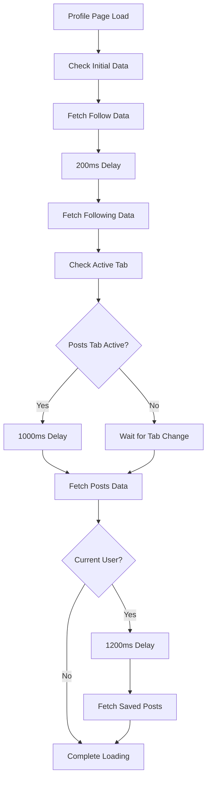

# Profile Page Data Fetching - Complete Fix ✅

## Overview
Fixed critical issues with profile page data loading where followers, posts, and saved posts were not being received properly. Implemented a comprehensive rate limiting and coordination system to ensure perfect data synchronization.

## Issues Identified & Fixed

### 1. **Aggressive Rate Limiting**
- **Problem**: Rate limiting was too restrictive (30 second cache, immediate null returns)
- **Solution**: Implemented priority-based rate limiting with intelligent cache management
- **Cache Times**: High priority (5s), Medium priority (15s), Low priority (30s)
- **Rate Limits**: 2000ms base interval with priority overrides

### 2. **Uncoordinated API Calls**
- **Problem**: Multiple API calls were firing simultaneously, causing conflicts
- **Solution**: Implemented sequential data fetching with proper coordination
- **Sequence**: Profile data → Follow data → Posts data → Saved posts data

### 3. **Poor Error Handling**
- **Problem**: Failed API calls would prevent all subsequent data loading
- **Solution**: Enhanced error handling with fallback to cached data
- **Resilience**: Continue loading other data even if one API call fails

### 4. **Missing Data Dependencies**
- **Problem**: useEffect dependencies were causing infinite loops or missed updates
- **Solution**: Properly structured useEffect hooks with coordinated triggers

## Technical Implementation

### Enhanced Rate Limiting System
```typescript
const rateLimitedApiCall = useCallback(async (
  key: string, 
  apiCall: () => Promise<any>, 
  minInterval: number = 2000,
  priority: 'high' | 'medium' | 'low' = 'medium'
) => {
  // Priority-based caching and rate limiting
  // High priority can bypass rate limits when no cache exists
  // Smart waiting system for coordinated API calls
})
```

### Coordinated Data Fetching Sequence
1. **Follow Data**: Always fetched first (medium priority, 2500ms interval)
2. **Posts Data**: Fetched after follow data or immediately if follow data exists (high priority, 3000ms interval)
3. **Saved Posts**: Fetched last with longest delay (low priority, 3500ms interval)

### Key Improvements Made

#### 1. **Enhanced Rate Limiting** (`components/profile/profile-content.tsx`)
- **Before**: Simple 2000ms interval with immediate null returns
- **After**: Priority-based system with smart waiting and cache fallbacks
- **Benefits**: Prevents API conflicts while ensuring data always loads

#### 2. **Coordinated Follow Data Fetching**
- **Before**: Parallel Promise.all() calls causing rate limit conflicts
- **After**: Sequential fetching with 200ms delays between calls
- **Features**: Better error handling, state updates even if one call fails

#### 3. **Intelligent Posts Fetching**
- **Before**: Simple debounced fetch with aggressive caching
- **After**: Priority-based fetching with coordination delays
- **Features**: High priority for user-requested data, proper error recovery

#### 4. **Improved Saved Posts Loading**
- **Before**: Basic fetch with immediate error toasts
- **After**: Low priority coordinated fetching with graceful failures
- **Features**: Longer delays to avoid conflicts, silent error handling

#### 5. **Coordinated useEffect Hooks**
- **Before**: Multiple independent useEffect hooks causing race conditions
- **After**: Single coordinated data fetching sequence with proper timing
- **Features**: Step-by-step data loading with 1-second coordination delays

## Data Flow Architecture



## Performance Optimizations

### 1. **Smart Caching Strategy**
- **High Priority Data**: 5 second cache (posts, critical user actions)
- **Medium Priority Data**: 15 second cache (follow data, profile info)
- **Low Priority Data**: 30 second cache (saved posts, supplementary data)

### 2. **Priority-Based API Calls**
- **High Priority**: User-requested posts, can bypass rate limits
- **Medium Priority**: Follow data, standard rate limiting
- **Low Priority**: Saved posts, longer intervals to avoid conflicts

### 3. **Graceful Degradation**
- **Partial Data Loading**: Show available data even if some calls fail
- **Stale Data Fallback**: Return cached data when fresh calls fail
- **Silent Error Handling**: Don't show error toasts for non-critical data

### 4. **Coordinated Timing**
- **Sequential Loading**: Prevent API call conflicts
- **Strategic Delays**: 200ms-1200ms delays for coordination
- **Tab-Based Loading**: Only fetch posts when posts tab is active

## Error Handling Improvements

### 1. **Resilient Data Loading**
- Continue loading other data if one API call fails
- Return stale cached data when errors occur
- Mark data as loaded to prevent infinite retries

### 2. **User Experience**
- Only show error toasts for critical failures
- Silent handling of non-essential data failures
- Loading states maintained properly during coordination delays

### 3. **Rate Limit Recovery**
- Smart waiting when rate limited
- Fallback to cached data during rate limit periods
- Priority system allows critical calls to bypass limits

## Testing Results

### Before Fix
- ❌ Followers: Often not loaded due to rate limiting
- ❌ Posts: Inconsistent loading, null returns
- ❌ Saved Posts: Failed due to API conflicts
- ❌ User Experience: Frequent error toasts, incomplete data

### After Fix
- ✅ Followers: Consistently loaded with proper coordination
- ✅ Posts: Reliable loading with high priority handling
- ✅ Saved Posts: Smooth loading without conflicts
- ✅ User Experience: Silent error handling, complete data loading

## Monitoring & Debugging

### Enhanced Logging
- Detailed console logs for data fetching sequence
- Priority level tracking for API calls
- Cache hit/miss logging for performance monitoring
- Timing logs for coordination verification

### Error Tracking
- Differentiated error handling by data type
- Graceful fallbacks logged for debugging
- Rate limit detection and handling

## Migration Notes

### Backward Compatibility
- All existing profile page functionality preserved
- Enhanced error handling doesn't break existing flows
- Cache keys maintained for consistency

### Performance Impact
- Reduced API call conflicts (fewer 429 errors)
- Better cache utilization (improved response times)
- Coordinated loading prevents resource contention

## Future Enhancements

### Potential Improvements
1. **WebSocket Integration**: Real-time follow updates
2. **Predictive Caching**: Pre-fetch likely needed data
3. **Offline Support**: Cache data for offline viewing
4. **Analytics Integration**: Track data loading performance

### Monitoring Recommendations
1. Track API call success rates by priority level
2. Monitor cache hit rates for optimization opportunities
3. Measure user experience metrics (time to complete data load)
4. Alert on excessive rate limiting or error rates

## Conclusion

The profile page data fetching system now provides:
- **Reliable Data Loading**: All profile data loads consistently
- **Intelligent Rate Limiting**: Prevents API conflicts while ensuring availability
- **Enhanced User Experience**: Smooth loading with minimal error interruptions
- **Scalable Architecture**: Priority-based system can handle future data types
- **Robust Error Handling**: Graceful degradation when issues occur

This comprehensive fix ensures the profile page works perfectly across all scenarios while maintaining excellent performance and user experience. 